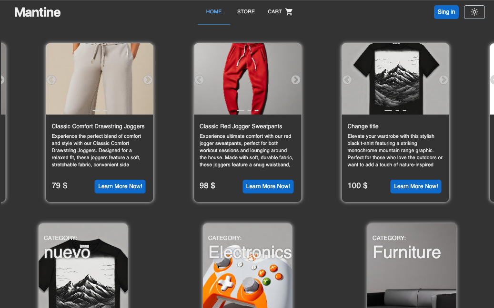

# Shop Application

## Demo
🌐 [Live Demo](demo_address)

## English Description 🇬🇧

An e-commerce application that allows users to browse and purchase products. It presents available inventory along with featured products. The app includes shopping cart functionality and a user authentication system with login and registration.

## Features
- Home page with recommended products and categories
- Navigation by product categories
- Detailed product cards with descriptions and photo galleries
- Interactive shopping cart with order modification
- User authentication system with login and registration
- Responsive interface optimized for all devices
- Automatic shopping cart content saving

## Project Structure
- `AppContext`: Global application state and data management
- `App`: Main component with routing configuration
- `Header`: Header with main navigation
- `Home`: Homepage with featured products and categories
- `Store`: Product list view with filtering
- `Cart`: Shopping cart management and order summary
- `ProductCart`: Detailed product view with gallery
- `SignIn`: Login and registration forms

## Technologies Used
- TypeScript
- React
- Vite 
- Material UI 
- React Router 
- Context API 
- SASS 

## Polski Opis 🇵🇱

Aplikacja sklepu internetowego umożliwiająca przeglądanie i zakup produktów. Prezentuje użytkownikowi dostępny asortyment wraz z przykładowymi produktami. Zawiera funkcjonalności koszyka oraz system logowania i rejestracji użytkowników.

## Funkcjonalności
- Strona główna z rekomendowanymi produktami oraz kategoriami
- Nawigacja według kategorii produktów
- Szczegółowe karty produktów z opisami i galeriami zdjęć
- Interaktywny koszyk z możliwością modyfikacji zamówienia
- System logowania oraz rejestracji użytkowników
- Responsywny interfejs dostosowany do wszystkich urządzeń

## Struktura projektu
- `AppContext`: Globalny stan aplikacji i zarządzanie danymi
- `App`: Komponent główny z konfiguracją routingu
- `Header`: Nagłówek z nawigacją główną
- `Home`: Strona główna z produktami polecanymi i kategoriami
- `Store`: Widok listy produktów z filtrowaniem
- `Cart`: Zarządzanie koszykiem i podsumowanie zamówienia
- `ProductCart`: Szczegółowy widok produktu z galerią
- `SignIn`: Formularze logowania i rejestracji

## Zastosowane technologie
- TypeScript 
- React 
- Vite 
- Material UI 
- React Router 
- Context API 
- SASS 